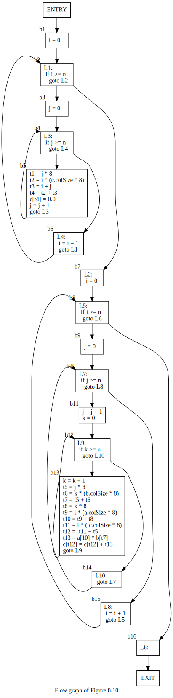
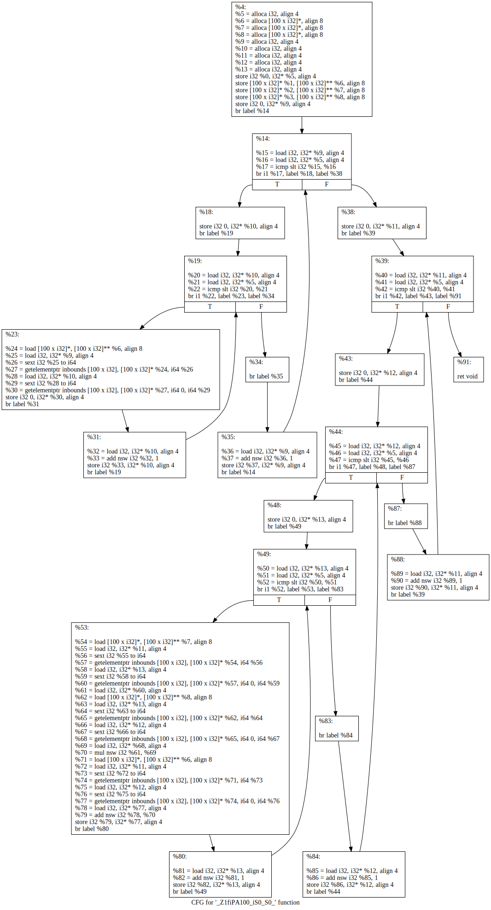
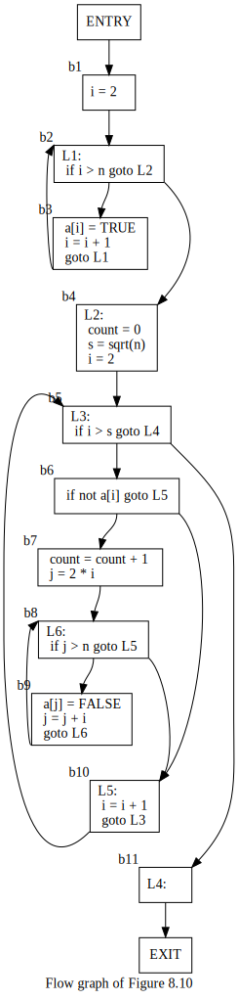
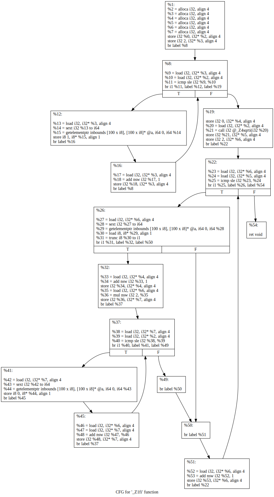

# Solutions to Exercise 8.4
## 8.4.1
### a)
```
  i = 0
L1:
  if i >= n goto L2
  j = 0
  L3:
  if j >= n goto L4
  t1 = j * 8
  t2 = i * (c.colSize * 8) // c.colSize * 8 is still a compile time constant
  t3 = i + j
  t4 = t2 + t3
  c[t4] = 0.0
  j = j + 1
  goto L3
L4:
  i = i + 1
  goto L1
L2:
  i = 0
L5:
  if i >= n goto L6
  j = 0
L7:
  if j >= n goto L8
  j = j + 1
  k = 0
L9:
  if k >= n goto L10
  k = k + 1
  t5 = j * 8
  t6 = k * (b.colSize * 8)
  t7 = t5 + t6
  t8 = k * 8
  t9 = i * (a.colSize * 8)
  t10 = t9 + t8
  t11 = i * ( c.colSize * 8)
  t12 =  t11 + t5
  t13 = a[10] * b[t7]
  c[t12] = c[t12] + t13
  goto L9
L10:
  goto L7
L8:
  i = i + 1
  goto L5
L6:
```
### b)
* b1
```
  i = 0
```
* b2
```
L1:
  if i >= n goto L2
```
* b3
```
  j = 0
```
* b4
```
L3:
  if j >= n goto L4
```
* b5
```
  t1 = j * 8
  t2 = i * (c.colSize * 8) // c.colSize * 8 is still a compile time constant
  t3 = i + j
  t4 = t2 + t3
  c[t4] = 0.0
  j = j + 1
  goto L3
```
* b6
```
L4:
  i = i + 1
  goto L1
```
* b7
```
L2:
  i = 0
```
* b8
```
L5:
  if i >= n goto L6
```
* b9
```
  j = 0
```
* b10
```
L7:
  if j >= n goto L8
```
* b11
```
  j = j + 1
  k = 0
```
* b12
```
L9:
  if k >= n goto L10
```
* b13
```
  k = k + 1
  t5 = j * 8
  t6 = k * (b.colSize * 8)
  t7 = t5 + t6
  t8 = k * 8
  t9 = i * (a.colSize * 8)
  t10 = t9 + t8
  t11 = i * ( c.colSize * 8)
  t12 =  t11 + t5
  t13 = a[10] * b[t7]
  c[t12] = c[t12] + t13
  goto L9
```
* b14
```
L10:
  goto L7
```
* b15
```
L8:
  i = i + 1
  goto L5
```
* b16
```
L6:
```


as a comparation, we shall see a control flow graph generated by llvm's opt:


### c)
* loop 1: b4, b5
* loop 2: b2, b3, b4, b5, b6
* loop 3: b12, b13
* loop 4: b10, b11, b12, b13, b14
* loop 5: b8, b9, b10, b11, b12, b13, b14, b15

## 8.4.2
### a)
```
  i = 2
L1:
  if i > n goto L2
  a[i] = TRUE
  i = i + 1
  goto L1
L2:
  count = 0
  s = sqrt(n)
  i = 2
L3:
  if i > s goto L4
  if not a[i] goto L5
  count = count + 1
  j = 2 * i
L6:
  if j > n goto L5
  a[j] = FALSE
  j = j + i
  goto L6
L5:
  i = i + 1
  goto L3
L4:
```
### b)
* b1
```
  i = 2
```
* b2
```
L1:
  if i > n goto L2
```
* b3
```
  a[i] = TRUE
  i = i + 1
  goto L1
```
* b4
```
L2:
  count = 0
  s = sqrt(n)
  i = 2
```
* b5
```
L3:
  if i > s goto L4
```
* b6
```
  if not a[i] goto L5
```
* b7
```
  count = count + 1
  j = 2 * i
```
* b8
```
L6:
  if j > n goto L5
```
* b9
```
  a[j] = FALSE
  j = j + i
  goto L6
```
* b10
```
L5:
  i = i + 1
  goto L3
```
* b11
```
L4:
```


also a cfg by llvm's opt:


### c)
* loop 1: b2, b3
* loop 2: b8, b9
* loop 3: b5, b6, b7, b8, b9
