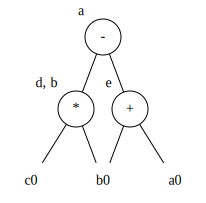
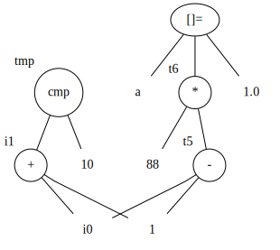
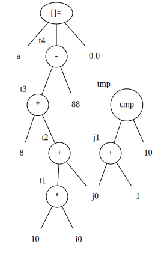

# Solutions to Exercise 8.5
## 8.5.1

## 8.5.2
original ssa:
```
d1 = b0 * c0
e1 = a0 + b0
b1 = b0 * c0
a1 = e1 - d1
```
### a)
```
d1 = b0 * c0
e1 = a0 + b0
a1 = e1 - d1
```
### b)
```
e1 = a0 + b0
b1 = b0 * c0
a1 = e1 - b1
```
## 8.5.3
ssa:
```
t5 = i0 - 1
t6 = 88 * t5
a[t6] = 1.0
i1 = i0 + 1
tmp = cmp i1, 10
```

DAG:


## 8.5.4
ssa:
```
t1 = 10 * i0
t2 = t1 + j0
t3 = 8 * t2
t4 = t3 - 88
a[t4] = 0.0
j1 = j0 + 1
tmp = cmp j1, 10
```

DAG:


## 8.5.5

Modify "METHOD" in Algorithm 8.7 as follows:
Scan backwards, at each statement:
0. If the statement is in the form "x = y + z", goto original step 1, 2, 3.
   If the statement is in the form "a[i] = b":
     
