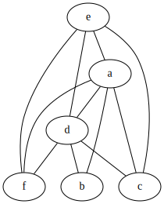
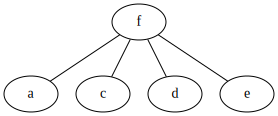
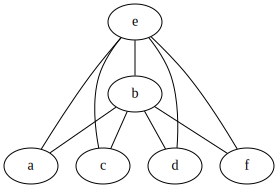
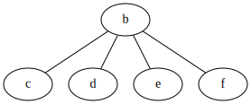
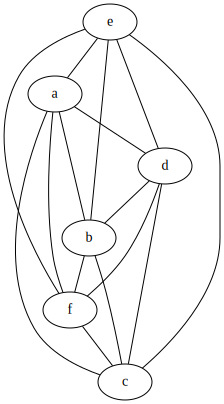

# Solutions to Exercise 8.8
## 8.8.1
First, work out liveness of each variable at each point in the program. We should add the liveness infomation after the first, second instructions of B1, and after the first instruction of B3:
B1:
```
a = b + 1
(a, b, c, d, f)
d = d - b
(a, c, d, f)
...
```
B3:
```
d = d + f
(a, b, c, d, f)
e = a - c
```
Second, construct register interference graph. For each variable definition, use the liveness right before this instruction.
For each block:

B1:


B2:


B3:


B4:


As a whole:

## 8.8.2
Strategies(on a per function basis):
* Start with inner blocks(or leaf blocks in dominator tree).
* Use heuristic evaluation function to determine which varible to spill.
* Add spilling and filling when necessary.

(These are indeed vague strategies, not a well-defined algorithm.)
