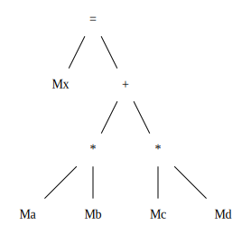
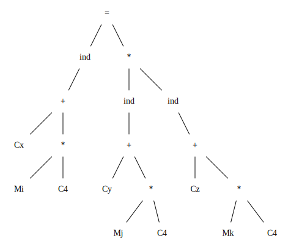
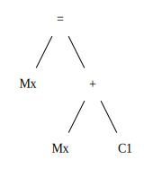

# Solutions to Exercise 8.9
## 8.9.1
### a)

```
LD  R0, a       // rule 2
LD  R1, b       // rule 2
MUL R2, R0, R1  // rule 7
LD  R3, c       // rule 2
LD  R4, d       // rule 2
MUL R5, R3, R4  // rule 7
ADD R6, R2, R5  // rule 7
ST  x, R6       // rule 3
```
### b)
Assuming x, y, z are constants(otherwise, rules in Figure 8.20 are not enough for codegen).

```
LD  R0, i         // rule 2
LD  R1, #4        // rule 1
MUL R0, R0, R1    // rule 7
LD  R2, x         // rule 1
ADD R2, R2, R0    // rule 7
LD  R3, j         // rule 2
LD  R4, #4        // rule 1
MUL R3, R3, R4    // rule 7
LD  R5, y(R3)     // rule 5
LD  R6, k         // rule 1
LD  R7, #4        // rule 1
MUL R6, R7, R7    // rule 7
ADD R5, R5, z(R6) // rule 6
ST  *R1, R5       // rule 4
```
### c)

```
LD  R0, x  // rule 2
INC R0     // rule 8
ST  x, R0  // rule 3
```
## 8.9.2
The results are the same as Exercise 8.9.1 .
## 8.9.3
TODO
## 8.9.4
Step 1: construct a dfs spanning tree of the DAG.

Step 2: Visiti each node in reverse order:
  Step 2.1: Try codegen for this sub tree. As we are in the reverse dfs order, all the node that this node can lead to in the DAG has been codegen-ed, therefore, we have enough infomation to try to reduce this node.
Step 3: If we successfully reduced the top node(ambiguity can be resolved arbitrarily or based on some cost model for instructions), we can descendant to its offsprings based on the rewriting rule we have choose for the root node. And we descendant recurrsively into each node's offsprings, emit code in a bottom-up order.
        Otherwise, our program is ill-formed, or our grammar is not sufficient.
